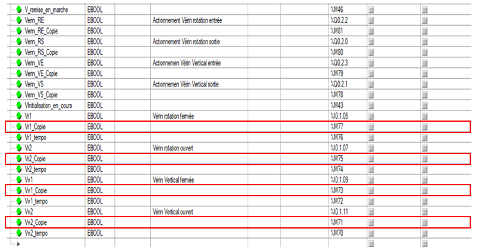
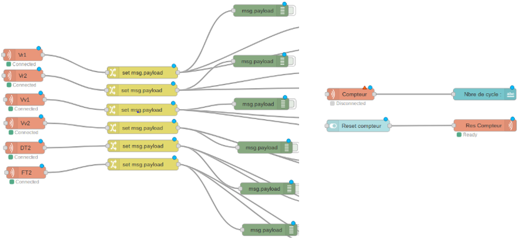
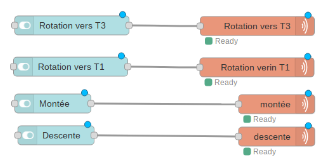
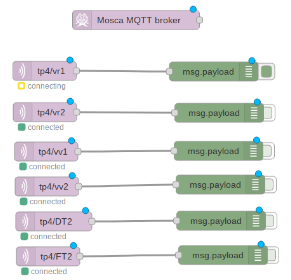
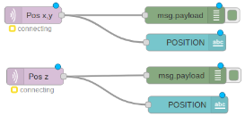

# Use of Modbus TCP for reading and writing data on M340-ATV

Welcome to my project! This project uses Modbus TCP communication technology to establish a connection between an application and an M340-ATV programmable logic controller, allowing for reading and writing of data on this controller.  
In this README file, you will find detailed information on setting up this connection, as well as instructions for using our application. I hope that this project will be useful to you, and please don't hesitate to contact me if you have any questions or comments.  

**The French version of this README can be found** [here](https://github.com/MehdiAllani/Utilisation-de-Modbus-TCP-pour-la-lecture-et-l-ecriture-de-donnes-sur-M340-ATV#utilisation-de-modbus-tcp-pour-la-lecture-et-l%C3%A9criture-de-donnes-sur-m340-atv).
---
Table of Contents :

1. [Context](https://github.com/MehdiAllani/Utilisation-de-Modbus-TCP-pour-la-lecture-et-l-ecriture-de-donnes-sur-M340-ATV/blob/main/ReadmeAng.md#1-context-)
2. [Project Objective](https://github.com/MehdiAllani/Utilisation-de-Modbus-TCP-pour-la-lecture-et-l-ecriture-de-donnes-sur-M340-ATV/blob/main/ReadmeAng.md#2-project-objective-)
3. [Presentation of the Conveyor and its Operation in Automatic Mode](https://github.com/MehdiAllani/Utilisation-de-Modbus-TCP-pour-la-lecture-et-l-ecriture-de-donnes-sur-M340-ATV/blob/main/ReadmeAng.md#3-presentation-of-the-conveyor-and-its-operation-in-automatic-mode-)
4. [Proposed Solution: (Industry 4.0 domain)](https://github.com/MehdiAllani/Utilisation-de-Modbus-TCP-pour-la-lecture-et-l-ecriture-de-donnes-sur-M340-ATV/blob/main/ReadmeAng.md#4-proposed-solution-industry-40-domain-)
5. [Problematic](https://github.com/MehdiAllani/Utilisation-de-Modbus-TCP-pour-la-lecture-et-l-ecriture-de-donnes-sur-M340-ATV/blob/main/ReadmeAng.md#5-problematic-)
6. [Implementation](https://github.com/MehdiAllani/Utilisation-de-Modbus-TCP-pour-la-lecture-et-l-ecriture-de-donnes-sur-M340-ATV/blob/main/ReadmeAng.md#6-implementation-)
	1. [Equipment](https://github.com/MehdiAllani/Utilisation-de-Modbus-TCP-pour-la-lecture-et-l-ecriture-de-donnes-sur-M340-ATV/blob/main/ReadmeAng.md#iequipment-)
	2. [Definition of the Communication Protocol](https://github.com/MehdiAllani/Utilisation-de-Modbus-TCP-pour-la-lecture-et-l-ecriture-de-donnes-sur-M340-ATV/blob/main/ReadmeAng.md#iidefinition-of-the-communication-protocol-)
	3. [Connection of the Three Devices to a Modbus TCP Network](https://github.com/MehdiAllani/Utilisation-de-Modbus-TCP-pour-la-lecture-et-l-ecriture-de-donnes-sur-M340-ATV/blob/main/ReadmeAng.md#iiiconnection-of-the-three-devices-to-a-modbus-tcp-network-)
	4. [Node-RED Program](https://github.com/MehdiAllani/Utilisation-de-Modbus-TCP-pour-la-lecture-et-l-ecriture-de-donnes-sur-M340-ATV/blob/main/ReadmeAng.md#ivnode-red-program-)
		1. [Reading Sensor Data](https://github.com/MehdiAllani/Utilisation-de-Modbus-TCP-pour-la-lecture-et-l-ecriture-de-donnes-sur-M340-ATV/blob/main/ReadmeAng.md#a-reading-sensor-data-)
		2. [Writing or Controlling through our Interface](https://github.com/MehdiAllani/Utilisation-de-Modbus-TCP-pour-la-lecture-et-l-ecriture-de-donnes-sur-M340-ATV/blob/main/ReadmeAng.md#b-writing-or-controlling-through-our-interface-)
		3. [Data Exchange](https://github.com/MehdiAllani/Utilisation-de-Modbus-TCP-pour-la-lecture-et-l-ecriture-de-donnes-sur-M340-ATV/blob/main/ReadmeAng.md#cdata-exchange-)
		4. [Visualization through a Node-RED Interface](https://github.com/MehdiAllani/Utilisation-de-Modbus-TCP-pour-la-lecture-et-l-ecriture-de-donnes-sur-M340-ATV/blob/main/ReadmeAng.md#d-visualization-through-a-node-red-interface)
7. [Video](https://github.com/MehdiAllani/Utilisation-de-Modbus-TCP-pour-la-lecture-et-l-ecriture-de-donnes-sur-M340-ATV/blob/main/ReadmeAng.md#7-video-)
8. [Conclusion](https://github.com/MehdiAllani/Utilisation-de-Modbus-TCP-pour-la-lecture-et-l-ecriture-de-donnes-sur-M340-ATV/blob/main/ReadmeAng.md#8conclusion-)

---

### 1. Context :

[The University of Physics and Engineering](https://eupi.uca.fr/) has a pedagogical production line, where a rotary conveyor (C) is used to transport parts provided by a conveyor (T1) to another conveyor (T2) perpendicular to T1. This rotary conveyor is a key element of this production line, as it allows for the transportation of parts from one station to another using sensors and actuators to optimize the production process. It is therefore crucial to understand its operation and use to ensure maximum efficiency of the production line.


### 2. Project Objective :

- Improving the connectivity, monitoring, and automation of an existing industrial machine.

### 3. Presentation of the Conveyor and its Operation in Automatic Mode :

This rotary conveyor is equipped with various sensors, such as cylinder and part position sensors, as well as several actuators, such as cylinders and motors. The entire system is controlled by an M340 programmable logic controller (PLC), which is responsible for executing the various processes of the machine.

```
1. Initial condition (Conveyor facing the conveyor (T1)).
2. Condition (Upon detecting a part at the beginning of the conveyor): conveyor goes up.
3. Condition (Once it has reached the top level): rotation towards the direction of the perpendicular conveyor (T2).
4. Condition (Once rotation is complete): conveyor goes down.
```

### 4. Proposed Solution: (Industry 4.0 domain) : 

- By integrating a Raspberry Pi board into this machine, we can connect the machine's sensors and actuators to the board. The board can then read the sensor data and send it to a remote monitoring system.
- By using Node-RED as the interface, we can create a user-friendly graphical interface to monitor the sensor data and the states of the actuators.


### 5. Problematic : 

- How to integrate a Raspberry Pi board into an automated industrial machine?
- How to design a Node-RED interface for real-time control of actuators and automation of industrial processes?

### 6. Implementation :

### i.Equipment : 

I have at my disposal the conveyor connected to a Schneider M340 PLC equipped with an NOC 0401 Ethernet communication module, a Raspberry Pi 3 B+ board, and a desktop computer.


### ii.Definition of the Communication Protocol : 

The communication between industrial automation devices is done with the Modbus protocol, while Ethernet is a communication protocol for local networks.

There is a Modbus variant called Modbus TCP that enables direct communication over Ethernet by encapsulating Modbus data into TCP/IP packets.

The relationship between Modbus and Ethernet can be established via a Modbus to Ethernet converter or directly through the **Modbus TCP protocol**.

### iii.Connection of the Three Devices to a Modbus TCP Network :

<pre>
There are three conditions to be met:

> The IP addresses of the three devices must be in the same IP network.
> The IP addresses must be within the range of IP addresses assigned to the network.
> The IP addresses must be different from each other (unique on the network).
</pre>

In this example,
```
We have defined the IP network as "192.168.0.0".
We have assigned a range of IP addresses from "192.168.0.1" to "192.168.0.254".
```

To meet these conditions, we can assign the following IP addresses to each device:
```
PLC: 192.168.0.1
Desktop computer: 192.168.0.241
Raspberry Pi board: 192.168.0.121
```

### iv.Node-RED Program : 

For the implementation of our project, we have developed 4 functionalities:

### a. Reading Sensor Data :

These are the steps I followed.

- **Identification of sensors and their addresses:**
```
For reading, we started by identifying the sensors throughout the system.  
We found 6 sensors, which means 6 data points to read:
```


- **Creation of copies of sensor addresses:**
```
To manipulate the state variables of our sensors, we created copies in the form of memory bits  
on the program of the M340 PLC, which is responsible for executing the various processes of  
the machine.
```


- **For data collection, we used 3 nodes:**
```
Modbus TCP Client node: it is sufficient to identify the variable type and its address.
Change node: which, in this case, allows to take a bit from a word-sized data.
Debug node: which allows to display the data transmitted in the flow.
```


### b. Writing or Controlling through our Interface :

For sending commands, we used 2 nodes:
```
Switch node: which allows to control the action of the conveyor.
Modbus TCP Client node: for writing msg.payload.
```


### c.Data Exchange :

For data exchange with another industrial machine equipped with another Raspberry Pi board, we added "mqtt out" nodes, which allow to publish messages to an MQTT broker.



To test the retrieval of our sensor values, we tested information sharing on 2 networks:

**1. wlan0 network:**

All my sensors are accessible from any board through:
```
Topic: tp4/Sensor_name
Network: 192.168.50.171 (wlan0)
```
**2. Local network:**
```
Topic: tp4/Sensor_name
Network: 127.0.0.1 (lo)
```
We were also able to retrieve the x, y, and z positions through:
```
Server: 192.168.50.83 (wlan0)
Topic: Pos x, y, and Pos z
```


### d. Visualization through a Node-RED Interface:

For visualization, I divided my data into groups and used:
```
Switch node for writing.
Text node for display.
```


### 7. Video :

[Video](https://youtu.be/ojUAjaii7UQ)

### 8.Conclusion :

Thanks to this project, I was able to acquire the following skills:

- Create a Modbus TCP network.
- Modify the IP address of a Raspberry Pi or PC.
- Establish a read communication.
- Establish a write communication.
- Visualize exchanges.
- Perform internal and external exchanges.

### Author

Created by [Mehdi Allani](https://www.linkedin.com/in/mehdi-allani-3a18ab1b2/) on April 08, 2023.


